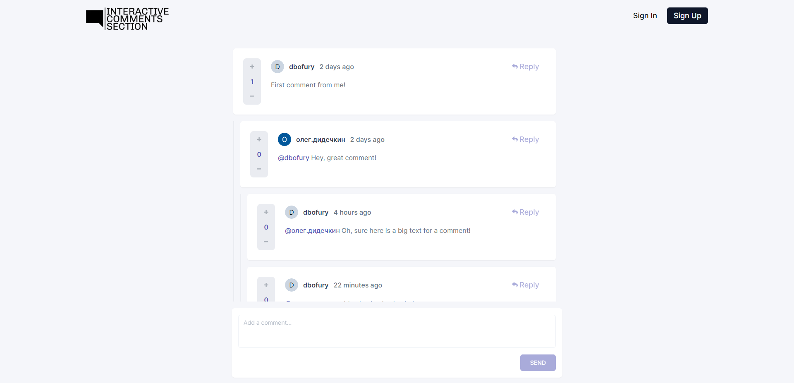
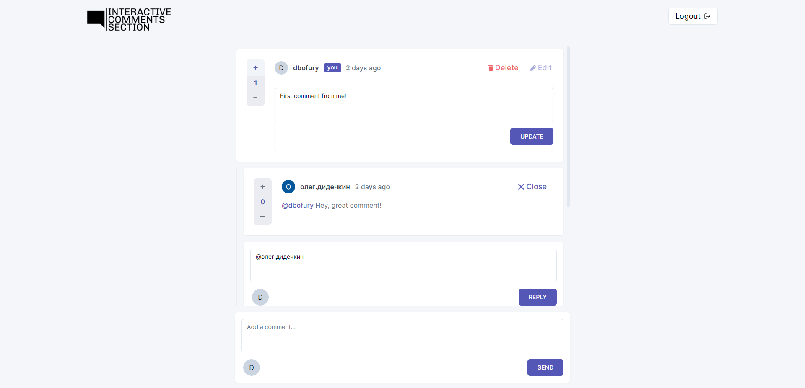
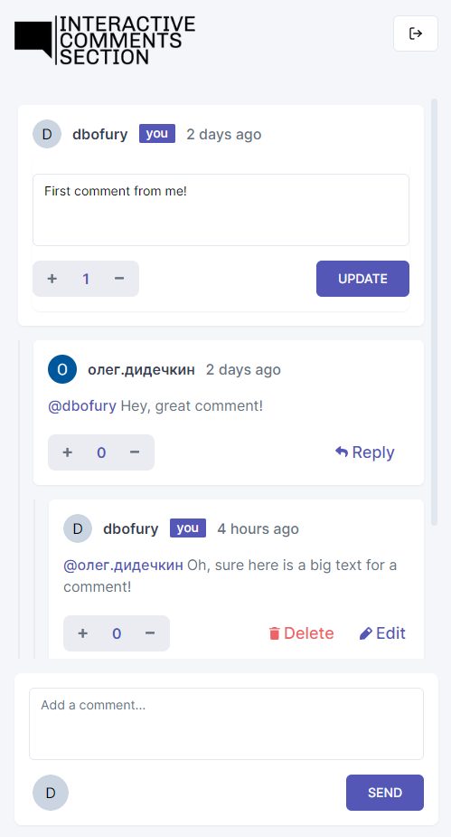

# Frontend Mentor - Interactive comments section solution

This is a solution to the [Interactive comments section challenge on Frontend Mentor](https://www.frontendmentor.io/challenges/interactive-comments-section-iG1RugEG9). Frontend Mentor challenges help you improve your coding skills by building realistic projects.

## Table of contents

- [Overview](#overview)
  - [The challenge](#the-challenge)
  - [Screenshot](#screenshot)
  - [Links](#links)
- [My process](#my-process)
  - [Built with](#built-with)
  - [What I learned](#what-i-learned)
  - [Continued development](#continued-development)
- [Author](#author)

## Overview

### The challenge

Users should be able to:

- View the optimal layout for the app depending on their device's screen size
- See hover states for all interactive elements on the page
- Create, Read, Update, and Delete comments and replies
- Upvote and downvote comments
- **Bonus**: If you're building a purely front-end project, use `localStorage` to save the current state in the browser that persists when the browser is refreshed.
- **Bonus**: Instead of using the `createdAt` strings from the `data.json` file, try using timestamps and dynamically track the time since the comment or reply was posted.

### Screenshot

1. Desktop
   

2. Desktop Active
   

3. Mobile

   

### Links

- Solution URL: [GitHub repository](https://github.com/Olacdy/interactive-comments-section/)
- Live Site URL: [Live site URL](https://interactive-comments-section-mocha.vercel.app/)

## My process

### Built with

- Semantic HTML5 markup
- Next
- Next Auth
- Prisma
- Supabase
- Shadcn UI
- TS
- Flexbox
- Mobile-first workflow
- [React](https://reactjs.org/) - JS library
- [TailwindCSS](https://tailwindcss.com/) - For styles

### What I learned

In this project, I aimed to create a full-stack application using Next.js app router and its latest features. To handle user management and authentication, I integrated Prisma as an ORM and Supabase to store data. I greatly expedited the development process of user authentication and leveraged Google's OAuth provider by incorporating Next-Auth library. For various UI components like dialogs or sheets, I employed Shadcn UI.

The primary challenge I encountered was configuring authentication with Next-Auth due to insufficient documentation on integrating it with Next.js app router.

### Continued development

I have a plan to transform this project into an open-source project. The primary aim is to fully explore and master the latest technologies used in the project, while also enhancing existing features and addressing any remaining bugs. Since I may not be entirely familiar with all the tools used, I believe opening it up to the community will bring in valuable contributions and diverse expertise. By making it open-source, I hope to create a collaborative environment that fosters learning and improvement.

## Author

- GitHub - [DBoFury](https://github.com/DBoFury)
- Frontend Mentor - [DBoFury](https://www.frontendmentor.io/profile/DBoFury)
